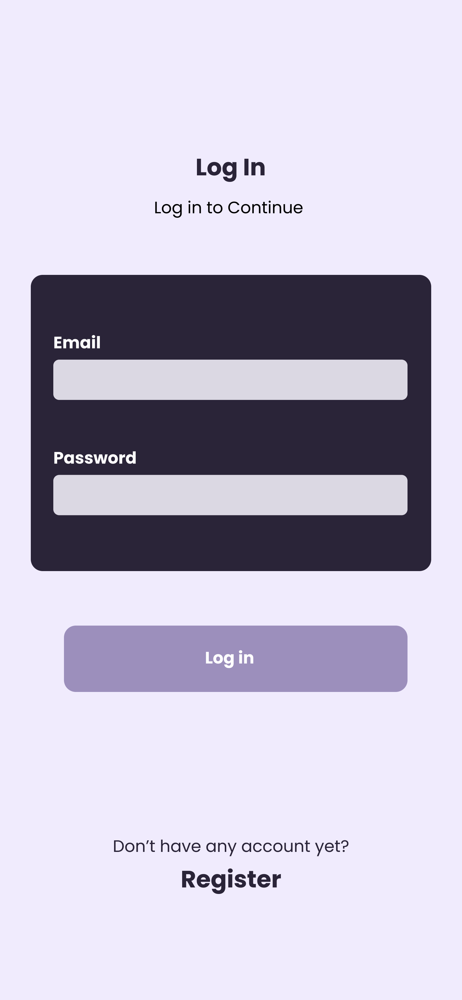
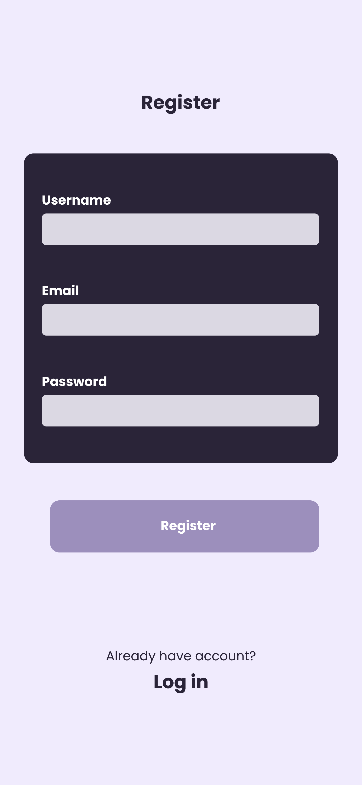
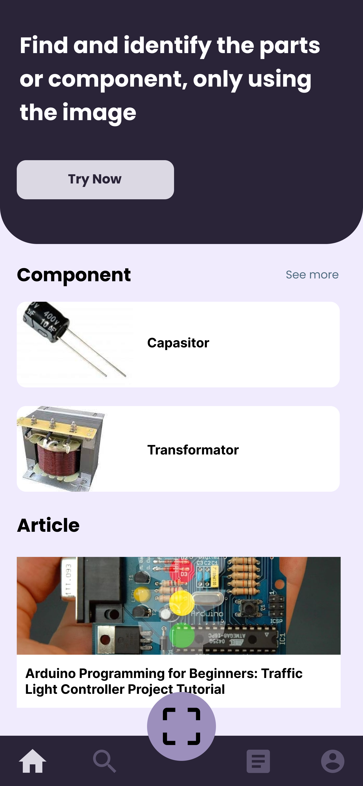
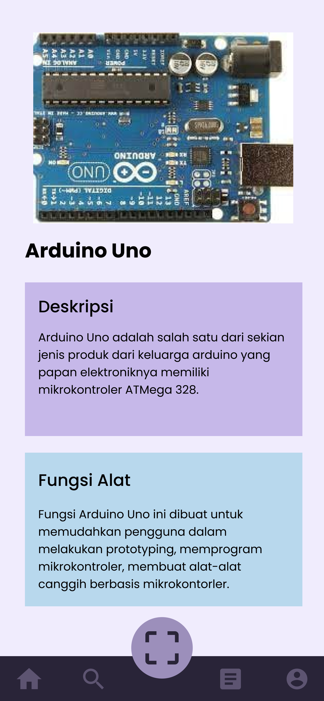
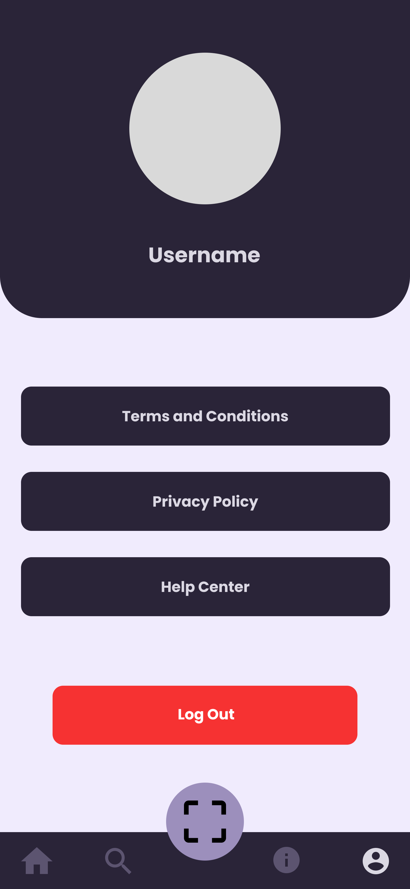
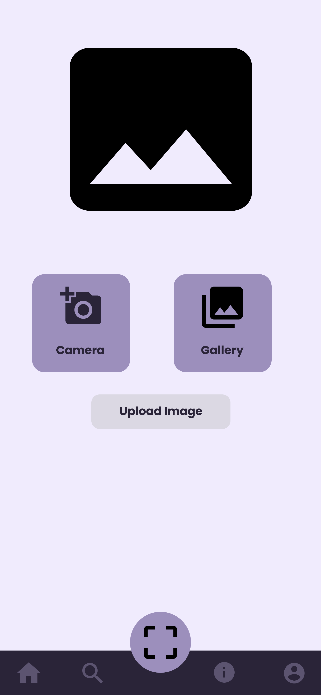

# Electronio - Apps

Capstone project for Bangkit 2023

## Team

Hello. this is our repository for our capstone project Bangkit 2023. Our team consist of 6 people from Machine Learning Path, Mobile Development Path and Cloud Computing Path.

| PIC | Learning Path     | Name                |
| :-------- | :------- | :------------------------- |
| A251DSX1083 | **Mobile Developer**| Ronaldi |
| M066DKX3868 | **Machine Learning**| Nanda Muhammad Rafi |
| M066DSX4950 |**Machine Learning** | Alpin Marwan Abu Hakam|
| M066DKX4375 |**Machine Learning** | Iwan Dwi Purwanto| 
| C160DSX4915 | **Cloud Computing** | Yosep Yonanda |
| C229DSX2190 | **Cloud Computing** | Lukmanul Hakim |

## Screenshots

   

   

   

